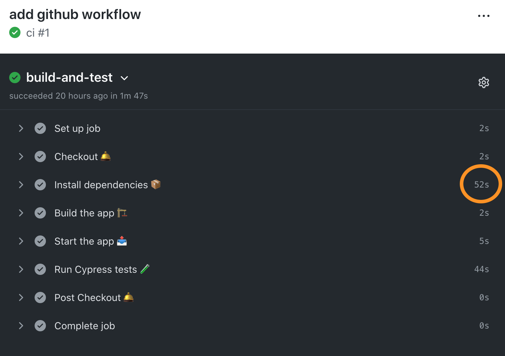
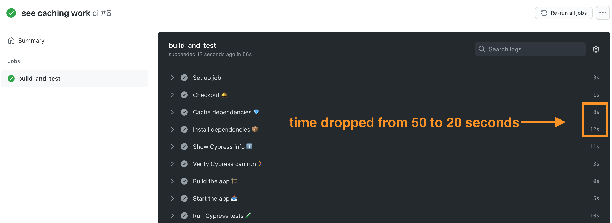

# Cypress on Generic CI

Using [GitHub Actions](https://glebbahmutov.com/blog/trying-github-actions/) as a demo

## 📚 You will learn

- Cypress Docker images for dependencies
- Installing and caching Cypress itself
- How to start server and run Cypress tests


💡 All our docs are at [https://on.cypress.io/ci](https://on.cypress.io/ci)

---
### GH Actions workflow

Create new file `.github/workflows/ci.yml` and paste the following

```yml
name: ci
on: [push]
jobs:
  build-and-test:
    runs-on: ubuntu-20.04
    steps:
      - name: Checkout 🛎
        uses: actions/checkout@v2

      - name: Install dependencies 📦
        run: npm ci

      - name: Build the app 🏗
        run: npm run build

      - name: Start the app 📤
        run: npm start &

      - name: Run Cypress tests 🧪
        run: npm run cy:run
```

📖 [GH Actions workflow syntax docs](https://docs.github.com/en/actions/reference/workflow-syntax-for-github-actions)

+++
## GitHub Actions tab

Commit the code and push back to GitHub. Then pick the Actions tab


+++
## Passed GH workflow


+++
### Common problems: OS

Typically Windows and Mac machines should have everything necessary to run Cypress. Linux CI machines sometimes might need extra libraries to run Cypress.

- 🚨 Cypress does not run in your Linux CI container
- ✅ Check OS dependencies [on.cypress.io/ci#Dependencies](https://on.cypress.io/ci#Dependencies)
- ✅ Use [cypress/base](https://github.com/cypress-io/cypress-docker-images#cypress-docker-images-) Docker image

💡 **Tip:** use `npx cypress verify` to make sure Cypress can run

+++
### Common problems: min requirements

- 🚨 Browser crashes
- 🚨 Video pauses or freezes
- 🚨 Tests are very slow
- ✅ See our notes at [on.cypress.io/ci#Machine-requirements](https://on.cypress.io/ci#Machine-requirements)

---
## 💡 Flakey CI

If your tests work locally but are flakey on CI:
- differences in timing, data, browser

Search our documentation


---
## Caching

Running tests on CI is like getting a brand new laptop every day - you have to install everything from scratch. It takes time!



+++
## What to cache?

- Caching `node_modules` **not recommended**
- If using NPM to install dependencies
  - use `npm ci`
  - cache `~/.npm` and `~/.cache/Cypress` folders
- If using Yarn to install dependencies
  - use `yarn install --frozen-lockfile`
  - cache `~/.cache` folder

**Tip:** Cypress cache command

```
$ npx cypress cache path
```

See 📚 at [on.cypress.io/caching](https://on.cypress.io/caching)

+++
Update workflow with caching

```yml
name: ci
on: [push]
jobs:
  build-and-test:
    runs-on: ubuntu-20.04
    steps:
      - name: Checkout 🛎
        uses: actions/checkout@v2

      - name: Cache dependencies 💎
        uses: actions/cache@v2
        with:
          path: |
            ~/.cache
            ~/.npm
          # use key string with "v1" for simple cache invalidation
          # use precise key to avoid cache "snowballing"
          # https://glebbahmutov.com/blog/do-not-let-cypress-cache-snowball/
          key: dependencies-v1-${{ runner.os }}-${{ hashFiles('**/package-lock.lock') }}

      - name: Install dependencies 📦
        run: npm ci

      - name: Show Cypress info ℹ️
        run: npx cypress info

      - name: Verify Cypress can run 🏃‍♂️
        run: npx cypress verify

      - name: Build the app 🏗
        run: npm run build

      - name: Start the app 📤
        run: npm start &

      - name: Run Cypress tests 🧪
        run: npm run cy:run
```

Push a few commits to see the caching timings

+++
## Caching works



+++
## ⚠️ Caching usually needs two commands

Typically CIs have one command to restore previous cache and another command to save the cache.

```yml
# CircleCI
- restore_cache:
    keys:
      - dependencies-{{ checksum "package.json" }}
- run: npm ci
# tip: cache the verified status
- run: npx cypress verify
- save_cache:
    key: dependencies-{{ checksum "package.json" }}
    paths:
    - ~/.npm
    - ~/.cache
```
+++
## ⚠️ Use precise cache key

```yml
- restore_cache:
    keys:
      - dependencies-{{ checksum "package.json" }}
      # 🚨 NOT RECOMMENDED fallback cache key
      - dependencies-
```

Check how many versions of Cypress you have after install

```
npx cypress cache list
```

```yml
- restore_cache:
    keys:
      # ✅ use single precise cache key
      - dependencies-{{ checksum "package-lock.json" }}
```

Read [https://glebbahmutov.com/blog/do-not-let-cypress-cache-snowball/](https://glebbahmutov.com/blog/do-not-let-cypress-cache-snowball/)
