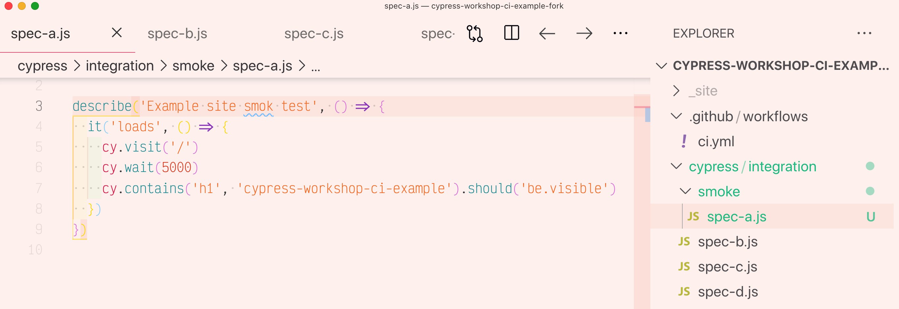
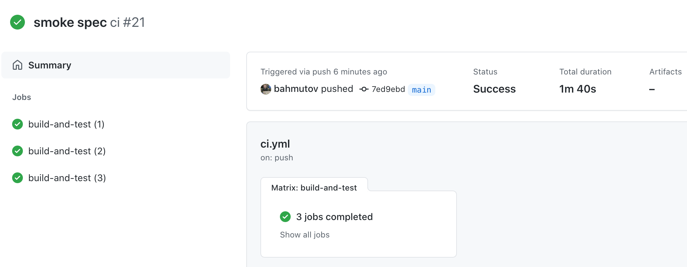
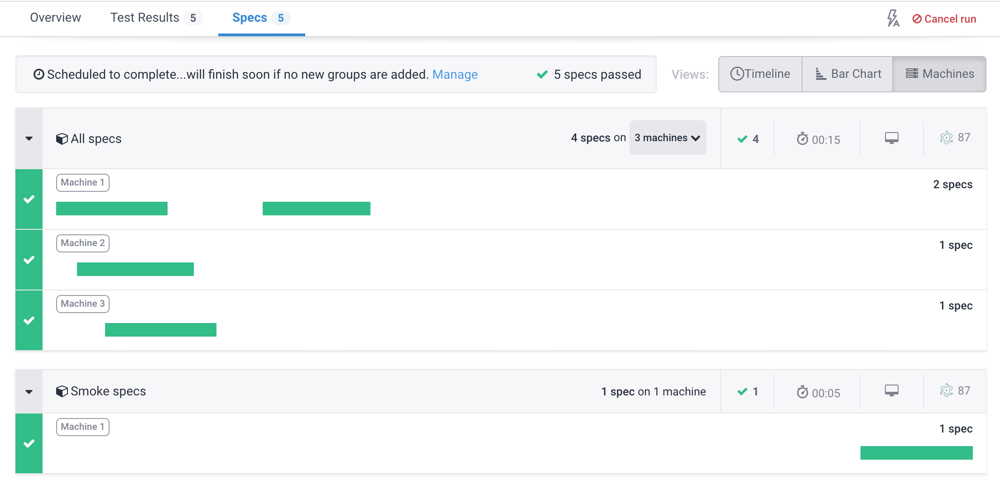
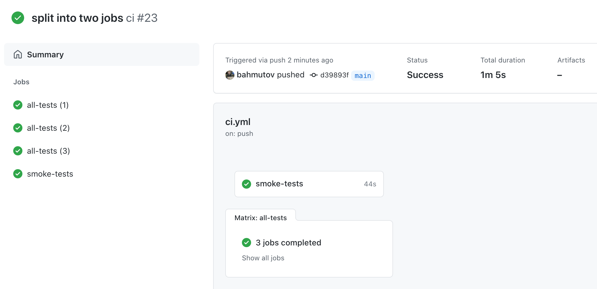
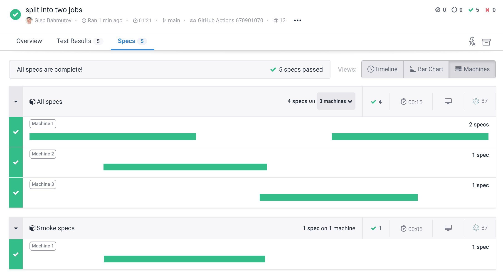
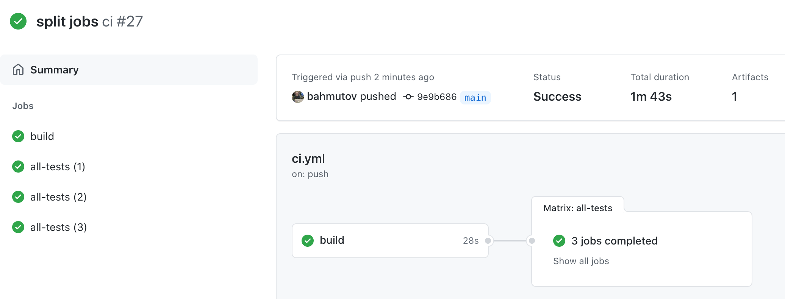

# Cypress GitHub Action

## 📚 You will learn

- How to **easily** run Cypress on GitHub Actions
- How to run Cypress tests in parallel
- How to split build and test jobs

💡 see [github.com/cypress-io/github-action](https://github.com/cypress-io/github-action)

---
## Motivation

You don't need to fiddle with caching, installation, flags, recording, etc. Let us (Cypress authors) write the CI configuration code (in JavaScript!).

Repo [github.com/cypress-io/github-action](https://github.com/cypress-io/github-action)
+++


---

```yml
# .github/workflow/ci.yml
name: ci
on: [push]
jobs:
  build-and-test:
    runs-on: ubuntu-20.04
    steps:
      - name: Checkout 🛎
        uses: actions/checkout@v2

      - name: Run Cypress tests 🧪
        uses: cypress-io/github-action@v2
        with:
          record: true
          start: npm start
          wait-on: 'http://localhost:8080'
        env:
          # pass the record key as environment variable
          # during this CI step
          CYPRESS_RECORD_KEY: ${{ secrets.CYPRESS_RECORD_KEY }}
```
Use the above workflow and inspect the run

+++
## TODO: Look at the action examples

[github.com/cypress-io/github-action#examples](https://github.com/cypress-io/github-action#examples)

+++
## TODO: show cypress info

💡 Hint: use the build command parameter
+++
```yml
- name: Run Cypress tests 🧪
  uses: cypress-io/github-action@v2
  with:
    build: npx cypress info
    record: true
    start: npm start
    wait-on: 'http://localhost:8080'
    browser: firefox
  env:
    # pass the record key as environment variable
    # during this CI step
    CYPRESS_RECORD_KEY: ${{ secrets.CYPRESS_RECORD_KEY }}
```

---
## Action versioning

- `uses: cypress-io/github-action@v2` uses the latest v2 branch of the action
- `uses: cypress-io/github-action@v2.9.3` uses specific tag
- `uses: cypress-io/github-action@dbe898` uses specific commit

---
## Run tests in parallel

- run tests faster by load balancing them across N machines
- use group names and tags
- parallelize each group separately

+++
### TODO: split spec into multiple specs


+++
### TODO: run a matrix of 3 machines

```yml
name: ci
on: [push]
jobs:
  build-and-test:
    runs-on: ubuntu-20.04
    strategy:
      fail-fast: false
      matrix:
        # run 3 copies of the current job in parallel
        containers: [1, 2, 3]
    steps:
      - name: Checkout 🛎
        uses: actions/checkout@v2

      - name: Run Cypress tests 🧪
        uses: cypress-io/github-action@v2
        with:
          record: true
          start: npm start
          wait-on: 'http://localhost:8080'
        env:
          # pass the record key as environment variable
          # during this CI step
          CYPRESS_RECORD_KEY: ${{ secrets.CYPRESS_RECORD_KEY }}
```

💡 see [cypress-io/github-action#parallel](https://github.com/cypress-io/github-action#parallel)

+++
### What do you see?


+++
### Turn on parallel mode

```diff
  uses: cypress-io/github-action@v2
  with:
    record: true
+   parallel: true
    start: npm start
    wait-on: 'http://localhost:8080'
```

**TODO:** inspect the output from each machine

+++
### Dashboard machines view


---
### Recording Groups

**Todo:** move one spec into "smoke" folder


+++
**Todo:** update the `ci.yml`

We want to run the smoke specs separately.
- first run all specs
- second run just the smoke specs
- give each group its own name

[github.com/cypress-io/github-action#examples](https://github.com/cypress-io/github-action#examples)

+++
```yml
name: ci
on: [push]
jobs:
  build-and-test:
    runs-on: ubuntu-20.04
    strategy:
      fail-fast: false
      matrix:
        # run 3 copies of the current job in parallel
        containers: [1, 2, 3]
    steps:
      - name: Checkout 🛎
        uses: actions/checkout@v2

      - name: Run Cypress tests 🧪
        uses: cypress-io/github-action@v2
        with:
          record: true
          parallel: true
          start: npm start
          wait-on: 'http://localhost:8080'
          group: All specs
        env:
          # pass the record key as environment variable
          # during this CI step
          CYPRESS_RECORD_KEY: ${{ secrets.CYPRESS_RECORD_KEY }}

      - name: Run Smoke tests 💨
        uses: cypress-io/github-action@v2
        with:
          record: true
          parallel: true
          start: npm start
          wait-on: 'http://localhost:8080'
          group: Smoke specs
          spec: 'cypress/integration/smoke/**/*.js'
        env:
          # pass the record key as environment variable
          # during this CI step
          CYPRESS_RECORD_KEY: ${{ secrets.CYPRESS_RECORD_KEY }}
```

+++


❓ What do you see in the output from each machine?

+++


❓ How did Cypress load balance these groups?
+++
**Todo:** avoid the second install in the smoke tests

```yml
- name: Run Smoke tests 💨
  uses: cypress-io/github-action@v2
  with:
    ???
    record: true
    parallel: true
    start: npm start
    wait-on: 'http://localhost:8080'
    group: Smoke specs
    spec: 'cypress/integration/smoke/**/*.js'
  env:
    # pass the record key as environment variable
    # during this CI step
    CYPRESS_RECORD_KEY: ${{ secrets.CYPRESS_RECORD_KEY }}
```

[github.com/cypress-io/github-action#examples](https://github.com/cypress-io/github-action#examples)

---
## Separate jobs

**Todo:** have one job run all specs and another job run the smoke specs
+++
```yml
name: ci
on: [push]
jobs:
  all-tests:
    runs-on: ubuntu-20.04
    strategy:
      fail-fast: false
      matrix:
        # run 3 copies of the current job in parallel
        containers: [1, 2, 3]
    steps:
      - name: Checkout 🛎
        uses: actions/checkout@v2

      - name: Run Cypress tests 🧪
        uses: cypress-io/github-action@v2
        with:
          record: true
          parallel: true
          start: npm start
          wait-on: 'http://localhost:8080'
          group: All specs
        env:
          # pass the record key as environment variable
          # during this CI step
          CYPRESS_RECORD_KEY: ${{ secrets.CYPRESS_RECORD_KEY }}

  smoke-tests:
    runs-on: ubuntu-20.04
    steps:
      - name: Checkout 🛎
        uses: actions/checkout@v2

      - name: Run Smoke tests 💨
        uses: cypress-io/github-action@v2
        with:
          record: true
          start: npm start
          wait-on: 'http://localhost:8080'
          group: Smoke specs
          spec: 'cypress/integration/smoke/**/*.js'
        env:
          # pass the record key as environment variable
          # during this CI step
          CYPRESS_RECORD_KEY: ${{ secrets.CYPRESS_RECORD_KEY }}
```

+++
### The workflow



+++

The Dashboard recording

---
### TODO: Split the build

- one job to build the site
  - uploads the built folder
- second job (parallel 3x) tests the site
  - downloads the built folder
  - starts the server
  - runs the tests

**Tip:** you can use Cypress GH Action to install without running tests

+++
```yml
name: ci
on: [push]
jobs:
  build:
    runs-on: ubuntu-20.04
    steps:
      - name: Checkout 🛎
        uses: actions/checkout@v2

      - name: Run Cypress tests 🧪
        uses: cypress-io/github-action@v2
        with:
          runTests: false
          build: npm run build
        env:
          # we do not need to install Cypress itself
          # as we do not plan to run tests
          CYPRESS_INSTALL_BINARY: 0

      - name: Upload built folder 📤
        uses: actions/upload-artifact@v2
        with:
          name: built
          path: _site

  all-tests:
    runs-on: ubuntu-20.04
    needs: build
    strategy:
      fail-fast: false
      matrix:
        # run 3 copies of the current job in parallel
        containers: [1, 2, 3]
    steps:
      - name: Checkout 🛎
        uses: actions/checkout@v2

      - name: Download built folder 📥
        uses: actions/download-artifact@v2
        with:
          name: built
          path: _site

      - name: Show built folder 👀
        run: ls -la _site

      - name: Run Cypress tests 🧪
        uses: cypress-io/github-action@v2
        with:
          record: true
          parallel: true
          start: npm start
          wait-on: 'http://localhost:8080'
          group: All specs
        env:
          # pass the record key as environment variable
          # during this CI step
          CYPRESS_RECORD_KEY: ${{ secrets.CYPRESS_RECORD_KEY }}
```
+++
### The workflow



---
## Advanced topics

- re-run job on failure using `GITHUB_TOKEN`, check [cypress-io/github-action](https://github.com/cypress-io/github-action) examples
- run smoke test after deploying the site
  - [glebbahmutov.com/blog/triple-tested/](https://glebbahmutov.com/blog/triple-tested/)
  - [glebbahmutov.com/blog/versioned-doc-pages/](https://glebbahmutov.com/blog/versioned-doc-pages/)
- more parallelization examples [glebbahmutov.com/blog/parallel-cypress-tests-gh-action/](https://glebbahmutov.com/blog/parallel-cypress-tests-gh-action/)
- working inside a monorepo [https://glebbahmutov.com/blog/test-monorepo-apps/](https://glebbahmutov.com/blog/test-monorepo-apps/)

---
## ⌛️ Review

- using [cypress-io/github-action](https://github.com/cypress-io/github-action) is the simplest way to install, cache, and run Cypress tests
- run parallel jobs to speed up the tests
- separate jobs in the workflow when makes sense

Jump to: [Generic CI](/?p=generic-ci), [GitHub Action](/?p=github-action), [CircleCI](/?p=circleci), [Netlify Build](/?p=netlify-build)
