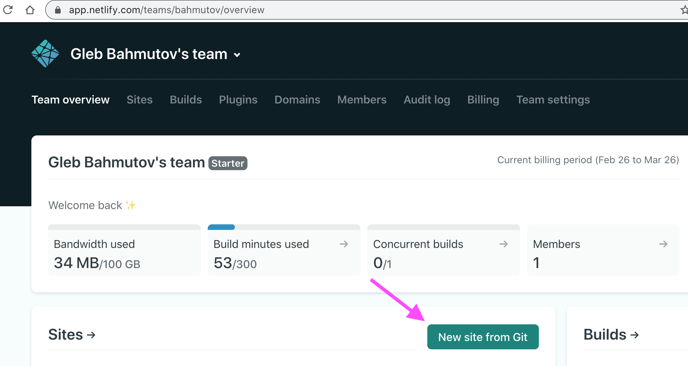
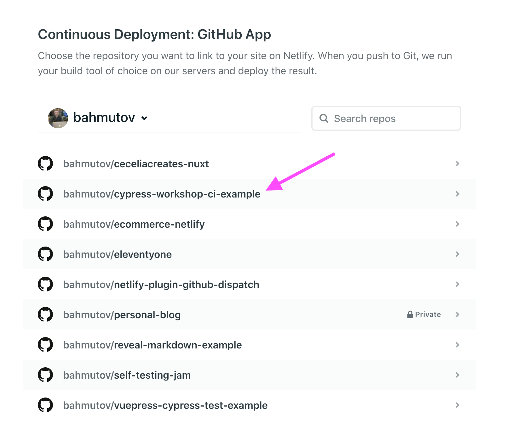
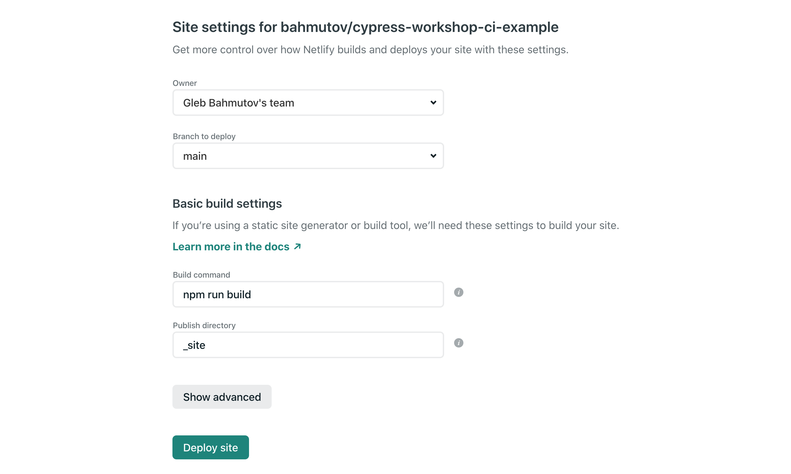
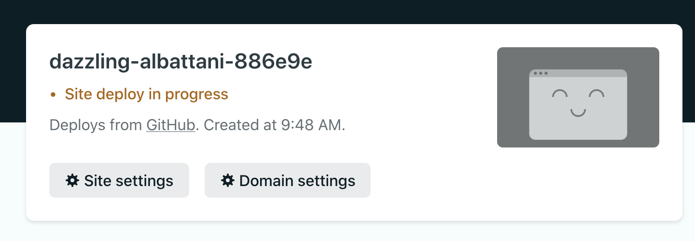
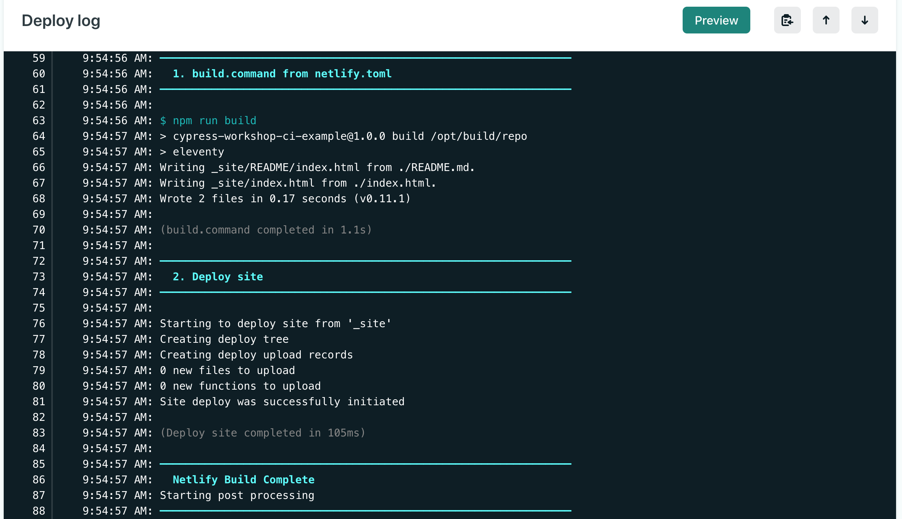
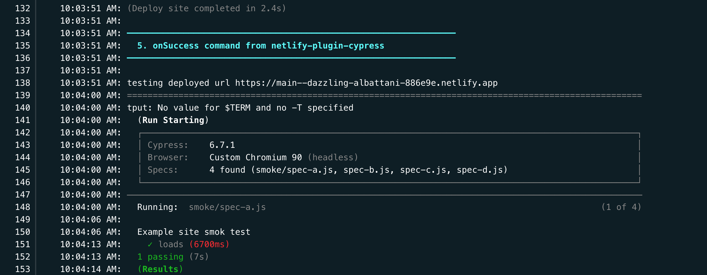

# Cypress Netlify Build Plugin

## 📚 You will learn

- How to **easily** run Cypress on Netlify
- How to run tests after the deploy
- How to run tests before the deploy

💡 see [github.com/cypress-io/netlify-plugin-cypress](https://github.com/cypress-io/netlify-plugin-cypress)

---
## Motivation

Deploying a web application to Netlify is very simple, and adding Cypress E2E to the deploy process via `netlify-plugin-cypress` is a breeze

Repo [github.com/cypress-io/netlify-plugin-cypress](https://github.com/cypress-io/netlify-plugin-cypress)

---


+++


+++


+++
### You can change the site name



---
## Use Netlify.toml file

Instead of the deploy settings in Netlify GUI

- explicit settings
- tracked in source control

+++
`netlify.toml` file

```toml
[build]
command = "npm run build"
publish = "_site"
```
+++
### Inspect the build log



---
## Let's start testing

```
$ npm i -D netlify-plugin-cypress
+ netlify-plugin-cypress@2.1.0
```

```toml
[build]
command = "npm run build"
publish = "_site"
[[plugins]]
  package = "netlify-plugin-cypress"
```

💡 see [github.com/cypress-io/netlify-plugin-cypress](https://github.com/cypress-io/netlify-plugin-cypress)

+++

### Inspect the build log



+++
### Fix the warning

```
tput: No value for $TERM and no -T specified
```

```toml
[build]
command = "npm run build"
publish = "_site"
[build.environment]
  TERM = "xterm"
[[plugins]]
  package = "netlify-plugin-cypress"
```

---
### Note that the tests are failing


